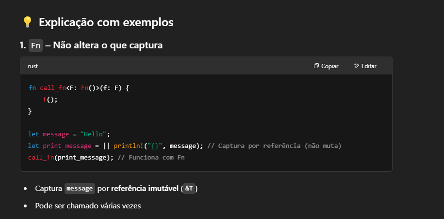
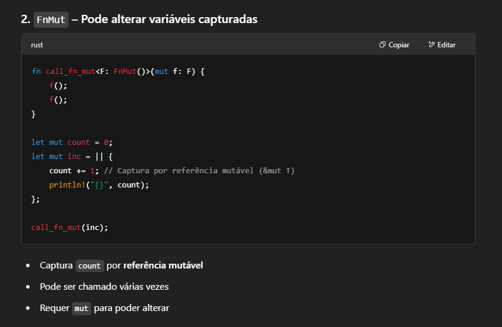
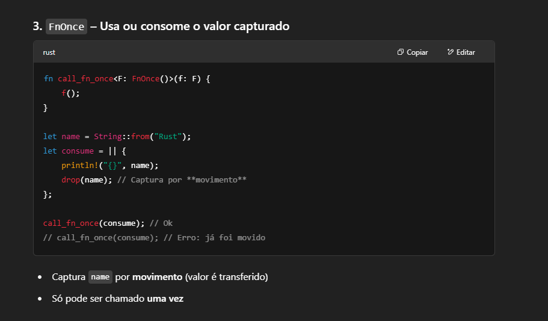
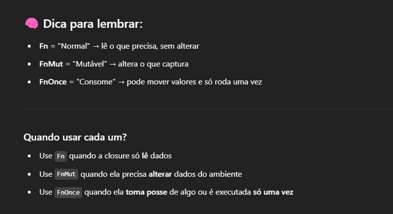

# What is Fn, FnMut, FnOnce
Fn, FnMut e FnOnce são traits (interfaces) fundamentais em Rust que definem como funções ou closures 
podem ser chamadas. A principal diferença entre elas está no acesso que a closure tem 
ao ambiente externo (captura de variáveis) e quantas vezes pode ser chamada.

