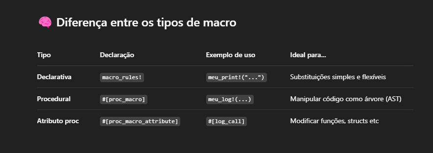

# Rust-Estudos

---
# Documentations
[https://doc.rust-lang.org/reference/introduction.html](https://doc.rust-lang.org/reference/introduction.html)
[https://doc.rust-lang.org/nomicon/intro.html](https://doc.rust-lang.org/nomicon/intro.html)
[https://doc.rust-lang.org/unstable-book/library-features/test.html](https://doc.rust-lang.org/unstable-book/library-features/test.html)

---
## Difference Between macros in runst

---
# Cargo
Cargo is Rust’s build system and package manager. Most Rustaceans use this tool to manage their Rust projects because 
Cargo handles a lot of tasks for you, such as building your code, downloading the libraries your code depends on, 
and building those libraries. (We call the libraries that your code needs dependencies.)

## Comandos úteis `cargo`
[https://doc.rust-lang.org/stable/cargo/](https://doc.rust-lang.org/stable/cargo/)

> `which cargo` Show where cargo is on the machine

> `ls ~/.cargo/bin` List all .exe installed inside folder 

> `cargo --version --verbose` (Show cargo version)

> `cargo doc --open` (command will build documentation provided by all your dependencies locally and open it in your browser.)

> `cargo install {{PACKAGE_NAME}}` Install installed global packages

> `cargo install --list` List installed global packages
 
> `cargo add {{CRATE_NAME}}` Add dependencies to a Cargo.toml manifest file

> `cargo add {{CRATE_NAME}} --dev` Add dev-dependencies to a Cargo.toml manifest file

> `cargo remove {{CRATE_NAME}}` Remove dependencies to a Cargo.toml manifest file

> `cargo remove {{CRATE_NAME}} --dev` Remove dev-dependencies to a Cargo.toml manifest file

> `cargo new` {{PROJECT_NAME}} Create a new binary project using cargo

> `cargo new {{PROJECT_NAME}} --lib ` }} Create a new lib project using cargo

> `cargo check` (Check your coe to make ure it compiles successfully)

> `cargo build` (Build entire project)

> `cargo build --release` (Build entire project with optimizations)

> `cargo run` (Build and run project)
 
> `RUST_BACKTRACE=1 cargo run` Execute rust more details about error handler

> `cargo test` Build and run tests in project

> `cargo test test_name` Runs all the tests that matched  `test_name`

> `cargo test --test file_name` Runs all the tests  in specific rust file  `file_name`

> `cargo test -- --ignored` Runs only tests containing the `ignore` attribute

> `cargo test -- --include-ignored` Run all tests whether they’re ignored or not.

> `cargo test --help` Displays the options you can use with cargo test

> `cargo test -- --help` Displays the options you can use after the separator

> `cargo test -- --test-threads=1` Set the number of test threads to 1, telling the program not to use any parallelism.

> `cargo test -- --show-output` Show printed values for passing tests as well, we can tell Rust to also show the output of successful tests

> `cargo add` {{PACKAGE_NAME}} (Add dependencies from a Cargo.toml manifest file)

> `cargo remove` {{PACKAGE_NAME}} (Remove dependencies from a Cargo.toml manifest file)

> `cargo update` (Update packages inside fix version: example 0.1.1 -> 0.1.9, to change minor and major version, you need to change manually version in Cargo.toml)

---
# Prelude
By default, Rust has a set of items defined in the standard library that it brings into the scope of every program. 
This set is called the prelude,

[https://doc.rust-lang.org/std/prelude/index.html](https://doc.rust-lang.org/std/prelude/index.html)

# Crates.io
Crate is a collection of Rust source code files. The project we’ve been building is a binary crate, which is an executable.

[https://crates.io/](https://crates.io/)

---
# Comandos úteis `rustc`

1. rustc --version (Show current rust version)
2. rustup update (Update rust)
3. rustup self uninstall (Uninstall rust)
4. rustup doc (Show offline documentation)
5. rustc {{FILE_MAIN.rs}} (Build .exe in windows)

---
# Pacótes úteis
[https://crates.io/crates/random](https://crates.io/crates/random) (Pacote para gerar números aleatórios)

---
# Testes

## tarpaulin

Pacote para gerar coverage `tarpaulin`  
Instalar pacote globalmente no cargo `cargo install cargo-tarpaulin`

### Comandos

> `cargo tarpaulin --tests` Executa todos os testes usando o pacote `tarpaulin`

> `cargo tarpaulin --tests --out Html` Executa todos os testes gerando resultado em um arquivo **HTML**

> `cargo tarpaulin --tests --test unit_test --out Html` Exemplo para executar somente testes de um arquivo específico
 
> `cargo tarpaulin --tests --test unit_test --out Html --exclude-files "*/mod.rs" --exclude-files "src/main.rs" --exclude-files "tests/*"` Exemplo para executar somente testes de um arquivo específico ignorando outros arquivos/pastas

---

## llvm-cov

Pacote para gerar coverage `llvm-cov`  
Instalar pacote globalmente no cargo `cargo install llvm-cov`

> `cargo llvm-cov --html` Executa todos os testes e exibe o coverage na linha de comando

> `cargo llvm-cov --html` Executa todos os testes e exibe o coverage em um arquivo HTML

> `cargo llvm-cov --html --test unit_test  --ignore-filename-regex 'main\.rs$|mod\.rs$'` Exemplo para executar somente testes de um arquivo específico ignorando outros arquivos/pastas